# Klassediagram

Systemets klasser, deres ansvar og hvem der kender hvem. Diagrammet er
kodedokumentation på linje med koden: **ændrer du en klasse, en signal-API
eller en afhængighed, skal diagrammet opdateres i samme commit.**

Filen renderes af GitHub/Bitbucket og af Mermaid-preview i VS Code.

## 1. Domæne og services

`HomeStore` er systemets eneste kilde til hjem-tilstand. Kun `SmartHomeApi`
taler HTTP, kun `HomeStore` skriver tilstand, og resten af appen læser signals.

```mermaid
classDiagram
    direction LR

    class SmartHomeApi {
        <<Injectable>>
        -http: HttpClient
        -baseUrl: string
        +getRooms() Promise~RoomDto[]~
        +createRoom(body) Promise~RoomDto~
        +updateRoom(id, body) Promise~RoomDto~
        +deleteRoom(id) Promise~void~
        +getDevices(query) Promise~DeviceDto[]~
        +getDiscoveredDevices() Promise~DiscoveredDeviceDto[]~
        +getDevice(id) Promise~DeviceDetailDto~
        +registerDevice(body) Promise~DeviceDetailDto~
        +updateDevice(id, body) Promise~DeviceDetailDto~
        +deleteDevice(id) Promise~void~
        +sendDeviceCommand(id, body) Promise~DeviceCommandAcceptedDto~
        +getDeviceHistory(id, query) Promise~SensorDataDto[]~
        +querySensorData(query) Promise~SensorDataDto[]~
        +ingestSensorData(body) Promise~SensorDataDto~
        +queryEventLog(query) Promise~EventLogDto[]~
        +getDashboardSummary() Promise~DashboardSummaryDto~
    }

    class Mapping {
        <<module>>
        +parseApiDate(value) Date
        +toApiTimestamp(date) string
        +toApiId(id) number
        +parseCommand(description) Command
        +parseDeviceKind(type) DeviceKind
        +mapRoom(dto) Room
        +mapDiscoveredDevice(dto) DiscoveredDevice
        +mapDevice(dto, readings, command, previous) Device
        +toDeviceUpdateDto(device) DeviceUpdateDto
        +groupLatestReadings(samples) Map
        +groupLatestCommands(events) Map
    }

    class HomeStore {
        <<Injectable root>>
        +status: Signal~StoreStatus~
        +rooms: Signal~Room[]~
        +devices: Signal~Device[]~
        +pendingSwitch: Signal~Map~
        +toasts: Signal~Toast[]~
        +lampsOnCount: Signal~number~
        +offlineDevices: Signal~Device[]~
        +load() Promise~void~
        +roomById(id) Room
        +deviceById(id) Device
        +devicesInRoom(roomId) Device[]
        +refreshDevice(id) Promise~Device~
        +toggleLamp(id) void
        +setAllLamps(on) void
        +addRoom(name) Promise~Room~
        +renameRoom(id, name) void
        +deleteRoom(id, moveToRoomId) void
        +addDevice(draft) Promise~Device~
        +renameDevice(id, name) void
        +moveDevice(id, roomId) void
        +removeDevice(id) void
        +showToast(input) number
        +runToastAction(id) void
        +dismissToast(id) void
        -commitRoomDeletion() Promise~void~
        -commitDeviceDeletion() Promise~void~
    }

    class DialogService {
        <<Injectable root>>
        +active: Signal~DialogState~
        -opener: HTMLElement
        +open(dialog) void
        +close() void
    }

    class ClockService {
        <<Injectable root>>
        +now: Signal~Date~
    }

    class DeviceDiscoveryService {
        <<Injectable root>>
        +discoverNewDevice() Promise~DiscoveredDevice~
    }

    class Room {
        <<interface>>
        +id: string
        +name: string
    }

    class Device {
        <<union type>>
        +id: string
        +roomId: string
        +name: string
        +online: boolean
        +updatedAt: Date?
        +updatedFrom: "data" | "seen" | null
        +mac: string?
        +ip: string?
        +registeredAt: Date?
        +kind: DeviceKind
    }

    class LampDevice {
        <<interface>>
        +kind: "lamp"
        +on: boolean
    }

    class ThermometerDevice {
        <<interface>>
        +kind: "thermometer"
        +temperature: number
        +humidity: number
    }

    class MotionSensorDevice {
        <<interface>>
        +kind: "motion"
        +lastMotionAt: Date
    }

    class HumiditySensorDevice {
        <<interface>>
        +kind: "humidity"
        +humidity: number
    }

    class DiscoveredDevice {
        <<interface>>
        +ssid: string
        +mac: string
        +signalStrength: number
    }

    class Toast {
        <<interface>>
        +id: number
        +message: string
        +variant: ToastVariant
        +ttlMs: number
        +action: ToastAction
    }

    class ToastAction {
        <<interface>>
        +label: string
        +run() void
    }

    Device <|-- LampDevice
    Device <|-- ThermometerDevice
    Device <|-- MotionSensorDevice
    Device <|-- HumiditySensorDevice

    HomeStore --> SmartHomeApi : bruger
    HomeStore ..> Mapping : DTO -> domæne
    HomeStore o-- Room : ejer
    HomeStore o-- Device : ejer
    HomeStore o-- Toast : ejer
    Toast --> ToastAction
    Room <.. Device : roomId
    DeviceDiscoveryService ..> DiscoveredDevice : finder
    note for DiscoveredDevice "Et accesspoint fra hub'ens wifi-scanning,<br/>ikke en raekke i databasen. Derfor kun<br/>navn, MAC og signal - enheden er ikke<br/>paa hjemmenettet endnu.
    DeviceDiscoveryService --> SmartHomeApi : GET /devices/discovered
```

## 2. UI-komponenter

Komponenterne er tynde: de læser signals fra `HomeStore`, kalder en
store-metode, og beder `DialogService` om at åbne overlays. Der er ingen
komponent-til-komponent-kald udenom store'n.

```mermaid
classDiagram
    direction TB

    class App {
        <<Component app-root>>
        -url: Signal~string~
        +onDevicesPage: Signal~boolean~
        +addMenuOpen: Signal~boolean~
        +openAddDevice() void
        +openCreateRoom() void
    }

    class TabletFrame {
        <<Component app-tablet-frame>>
        -viewport: Signal~ViewportSize~
        +scale: Signal~string~
    }

    class HomePage {
        <<Component>>
        +anyLampOn: Signal~boolean~
        +anyLamps: Signal~boolean~
        +noDevices: Signal~boolean~
        +showQuietTile: Signal~boolean~
        +lightHeadline: Signal~string~
        +roomsReadyHeadline: Signal~string~
        +roomNames: Signal~string~
        +quietSummary: Signal~string~
        +alertTiles: Signal~AlertTileVm[]~
        +roomTiles: Signal~RoomTileVm[]~
    }

    class RoomFormat {
        <<module>>
        +roomReading(devices) RoomReading
        +roomMeasurement(devices) string?
        +offlineCountLabel(count) string
    }

    class RoomsPage {
        <<Component>>
        +rows: Signal~RoomRowVm[]~
    }

    class RoomDetailPage {
        <<Component>>
        +id: Input~string~
        +room: Signal~Room~
        +devices: Signal~Device[]~
    }

    class DevicesPage {
        <<Component>>
        +rows: Signal~DeviceRowVm[]~
    }

    class DialogHost {
        <<Component app-dialog-host>>
        +renameTarget: Signal~RenameTarget~
        +deviceDetailId: Signal~string~
    }

    class ToastHost {
        <<Component app-toast-host>>
    }

    class AddDeviceDialog {
        <<Component>>
        +phase: Signal~SearchPhase~
        +devices: Signal~DiscoveredDevice[]~
        +selected: Signal~DiscoveredDevice?~
        +step: Signal~number~
    }
    class CreateRoomDialog {
        <<Component>>
        +suggestions: Signal~string[]~
    }
    class RenameDialog {
        <<Component>>
        +target: Input~RenameTarget~
    }
    class DeleteRoomDialog {
        <<Component>>
        +roomId: Input~string~
        +needsTarget: Signal~boolean~
    }
    class MoveDeviceDialog {
        <<Component>>
        +deviceId: Input~string~
    }
    class DeviceMenuSheet {
        <<Component>>
        +deviceId: Input~string~
    }
    class DeviceDetailDialog {
        <<Component>>
        +deviceId: Input~string~
        +history: Signal~HistoryPoint[]~
        +sparkPoints: Signal~string~
    }

    class Modal {
        <<Component app-modal>>
        +label: Input~string~
        +closed: Output~void~
    }
    class ToggleSwitch {
        <<Component app-toggle-switch>>
        +checked: Input~boolean~
        +disabled: Input~boolean~
        +toggled: Output~void~
    }
    class EmptyState {
        <<Component app-empty-state>>
        +create: Output~void~
    }
    class LoadState {
        <<Component app-load-state>>
        +status: Input~StoreStatus~
        +retry: Output~void~
    }
    class LongPressDirective {
        <<Directive appLongPress>>
        +appLongPress: Output~void~
    }
    class DeviceFormat {
        <<module>>
        +lampStateText() string
        +deviceStatusText() string
        +deviceCountLabel() string
    }
    class RelativeTime {
        <<module>>
        +relativeTimeLabel(value, now) string
        +clockLabel(value) string
    }

    note for TabletFrame "iPad-lærred 1366x1024 (landskab)\nskaleres ned til vinduet"

    App *-- TabletFrame
    App *-- DialogHost
    App *-- ToastHost
    TabletFrame o-- HomePage : router-outlet
    TabletFrame o-- RoomsPage : router-outlet
    TabletFrame o-- RoomDetailPage : router-outlet
    TabletFrame o-- DevicesPage : router-outlet

    DialogHost --> AddDeviceDialog
    DialogHost --> CreateRoomDialog
    DialogHost --> RenameDialog
    DialogHost --> DeleteRoomDialog
    DialogHost --> MoveDeviceDialog
    DialogHost --> DeviceMenuSheet
    DialogHost --> DeviceDetailDialog

    AddDeviceDialog *-- Modal : pakker sig i
    CreateRoomDialog *-- Modal : pakker sig i
    RenameDialog *-- Modal : pakker sig i
    DeleteRoomDialog *-- Modal : pakker sig i
    MoveDeviceDialog *-- Modal : pakker sig i
    DeviceMenuSheet *-- Modal : pakker sig i
    DeviceDetailDialog *-- Modal : pakker sig i

    HomePage ..> RoomFormat : rummets måling
    RoomsPage ..> RoomFormat : rummets tilstand
    HomePage ..> ToggleSwitch
    HomePage ..> LongPressDirective
    RoomsPage ..> EmptyState
    RoomDetailPage ..> ToggleSwitch
    DevicesPage ..> ToggleSwitch
    HomePage ..> LoadState
    HomePage ..> DeviceFormat
    DevicesPage ..> DeviceFormat
    DeviceDetailDialog ..> RelativeTime

    App ..> HomeStore
    App ..> DialogService
    HomePage ..> HomeStore
    RoomsPage ..> HomeStore
    RoomDetailPage ..> HomeStore
    DevicesPage ..> HomeStore
    DialogHost ..> DialogService
    ToastHost ..> HomeStore
    AddDeviceDialog ..> DeviceDiscoveryService
    DeviceDetailDialog ..> ClockService
```



## Vedligeholdelse

Tjekliste når koden ændrer sig:

1. Ny/fjernet komponent, service, direktiv eller domænetype → tilføj/fjern klassen.
2. Ny offentlig metode, `input()`, `output()` eller signal → opdatér klassens medlemmer.
3. Ny afhængighed (`inject(...)`, import i `imports: []`) → opdatér pilene.
4. Kør en Mermaid-preview før commit, så diagrammet stadig kan renderes.
